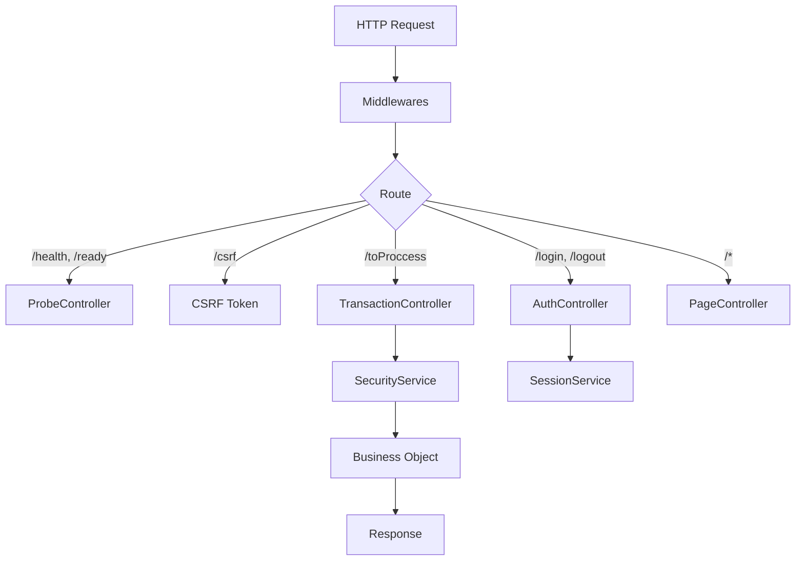

# AppServer Core: The HTTP Entry Point

The `AppServer` (formerly Dispatcher) is the core entry point to the system. It bootstraps Express and wires up the Controllers.

## Architecture



## Responsibilities

### 1. AppServer (`AppServer.ts`)

- **Bootstrap**: Configures Express, Helmet, CORS, BodyParsers.
- **Routing**: Maps URLs to Controllers.
- **Lifecycle**: Handles `init()`, `serverOn()`, and `shutdown()`.

### 2. TransactionController (`TransactionController.ts`)

- **Orchestration**: Handles the master route `/toProccess`.
- **Logic**: Validates `tx`, checks permissions, executes BOs via `SecurityService`.

### 3. AuthController (`AuthController.ts`)

- **Authentication**: Handles `/login` and `/logout`.
- **Logic**: Delegates to `SessionService` and manages HTTP responses.

### 4. ProbeController (`ProbeController.ts`)

- **Observability**: Handles `/health` and `/ready`.
- **Logic**: Checks system uptime and security service readiness.

### 5. PageController (`PageController.ts`)

- **Static Content**: Serves views from `public/pages`.
- **Routing**: Fallback for all non-API routes.

## The Master Route: `/toProccess`

Managed by `TransactionController`.

```typescript
POST /toProccess
Content-Type: application/json
X-CSRF-Token: <token>

{
  "tx": 1001,
  "params": { ... }
}
```

### Internal Flow

```
┌─────────────────────────────────────────────────────────────┐
│  1. Validate session → get profileId                        │
│  2. Validate body (tx: number, params: object)              │
│  3. Resolve tx → objectName + methodName                    │
│  4. Check permissions (SecurityService.getPermissions)      │
│  5. Execute method (SecurityService.executeMethod)          │
│  6. Log audit                                               │
│  7. Respond to client                                       │
└─────────────────────────────────────────────────────────────┘
```

## Error Handling

The `createFinalErrorHandler` middleware centralizes handling:

1. **Marks** `res.locals.__errorLogged = true` to avoid duplicate logs
2. **Logs** error redacting secrets
3. **Responds** with generic error (no sensitive information leakage)

```typescript
// Client receives
{ "code": 500, "msg": "Server error" }

// Log receives (server-side)
"Server error, /toProccess: Cannot read property 'x' of undefined"
// + full stack trace + context (userId, profileId, tx, etc.)
```

## See Also

- [Bootstrap](./BOOTSTRAP.en.md) - System initialization
- [Security System](./SECURITY_SYSTEM.en.md) - Permissions and transactions
- [Transaction Flow](./TRANSACTION_FLOW.en.md) - Business method execution
