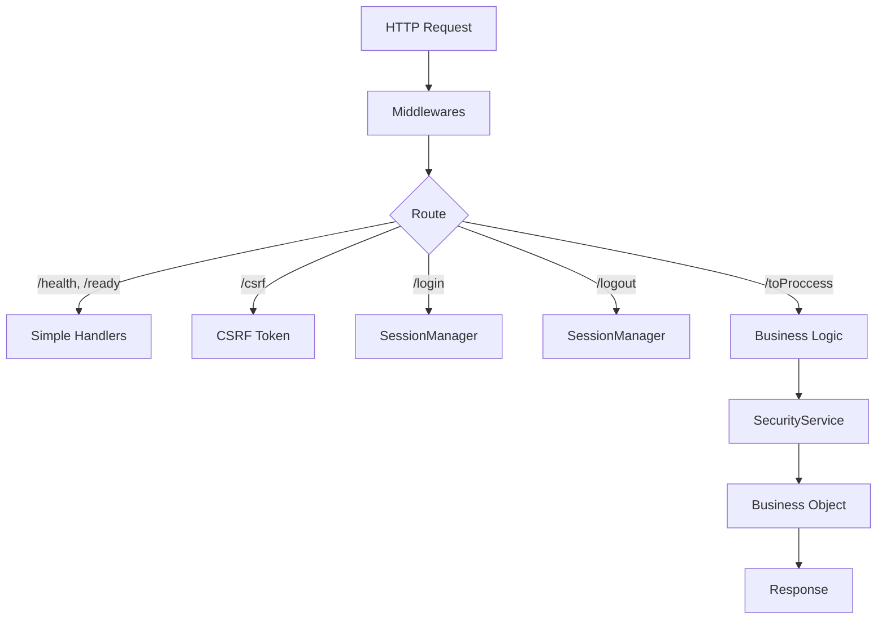

# Dispatcher Core: The HTTP Orchestrator

The `Dispatcher` is the single entry point to the system. It centralizes routing, security, and error handling to ensure consistency.

## Architecture



## Lifecycle

### Constructor

Configures Express with base middlewares:

1. **Helmet** - Secure HTTP headers
2. **RequestId** - Unique UUID per request
3. **RequestLogger** - Structured logging
4. **CORS** - Cross-domain access control
5. **BodyParser** - JSON with configurable limit

### `init()`

Completes initialization:

1. **express-session** - Persistent sessions in PostgreSQL
2. **Frontend Adapters** - Serve SPA or static pages
3. **API Routes** - `/health`, `/ready`, `/csrf`, `/toProccess`, `/login`, `/logout`
4. **Error Handler** - Catches unhandled errors

## The Master Route: `/toProccess`

99% of business logic flows through this endpoint.

```typescript
POST /toProccess
Content-Type: application/json
X-CSRF-Token: <token>

{
  "tx": 1001,
  "params": { ... }
}
```

### Internal Flow

```
┌─────────────────────────────────────────────────────────────┐
│  1. Validate session → get profileId                        │
│  2. Validate body (tx: number, params: object)              │
│  3. Resolve tx → objectName + methodName                    │
│  4. Check permissions (SecurityService.getPermissions)      │
│  5. Execute method (SecurityService.executeMethod)          │
│  6. Log audit                                               │
│  7. Respond to client                                       │
└─────────────────────────────────────────────────────────────┘
```

### Protections

| Middleware                     | Purpose                           |
| ------------------------------ | --------------------------------- |
| `toProccessRateLimiter`        | Request limit per IP              |
| `authPasswordResetRateLimiter` | Specific limit for password reset |
| `csrfProtection`               | CSRF token validation             |

## Authentication

### `/login`

Delegates to `SessionManager.createSession()`:

- Validates credentials
- Creates session in PostgreSQL
- Sets secure cookie

### `/logout`

- Destroys session
- Logs audit
- Responds with success message

## Error Handling

The `handleError()` method centralizes handling:

1. **Marks** `res.locals.__errorLogged = true` to avoid duplicate logs
2. **Logs audit** (only for `/toProccess`)
3. **Logs** error redacting secrets
4. **Responds** with generic error (no sensitive information leakage)

```typescript
// Client receives
{ "code": 500, "msg": "Server error" }

// Log receives (server-side)
"Server error, /toProccess: Cannot read property 'x' of undefined"
// + full stack trace + context (userId, profileId, tx, etc.)
```

## See Also

- [Bootstrap](./BOOTSTRAP.en.md) - System initialization
- [Security System](./SECURITY_SYSTEM.en.md) - Permissions and transactions
- [Transaction Flow](./TRANSACTION_FLOW.en.md) - Business method execution
