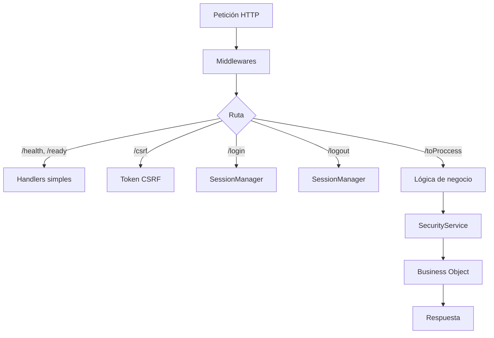

# Dispatcher Core: El Orquestador HTTP

El `Dispatcher` es la puerta de entrada única al sistema. Centraliza el ruteo, la seguridad y el manejo de errores para garantizar consistencia.

## Arquitectura



## Ciclo de Vida

### Constructor

Configura Express con middlewares base:

1. **Helmet** - Headers HTTP seguros
2. **RequestId** - UUID único por petición
3. **RequestLogger** - Logging estructurado
4. **CORS** - Control de acceso entre dominios
5. **BodyParser** - JSON con límite configurable

### `init()`

Completa la inicialización:

1. **express-session** - Sesiones persistentes en PostgreSQL
2. **Frontend Adapters** - Servir SPA o páginas estáticas
3. **Rutas API** - `/health`, `/ready`, `/csrf`, `/toProccess`, `/login`, `/logout`
4. **Error Handler** - Captura errores no manejados

## La Ruta Maestra: `/toProccess`

El 99% de la lógica de negocio pasa por este endpoint.

```typescript
POST /toProccess
Content-Type: application/json
X-CSRF-Token: <token>

{
  "tx": 1001,
  "params": { ... }
}
```

### Flujo interno

```
┌─────────────────────────────────────────────────────────────┐
│  1. Validar sesión → obtener profileId                      │
│  2. Validar body (tx: number, params: object)               │
│  3. Resolver tx → objectName + methodName                   │
│  4. Verificar permisos (SecurityService.getPermissions)     │
│  5. Ejecutar método (SecurityService.executeMethod)         │
│  6. Registrar auditoría                                     │
│  7. Responder al cliente                                    │
└─────────────────────────────────────────────────────────────┘
```

### Protecciones

| Middleware                     | Función                                  |
| ------------------------------ | ---------------------------------------- |
| `toProccessRateLimiter`        | Límite de requests por IP                |
| `authPasswordResetRateLimiter` | Límite específico para reset de password |
| `csrfProtection`               | Validación de token CSRF                 |

## Autenticación

### `/login`

Delega al `SessionManager.createSession()`:

- Valida credenciales
- Crea sesión en PostgreSQL
- Establece cookie segura

### `/logout`

- Destruye sesión
- Registra auditoría
- Responde con mensaje de éxito

## Manejo de Errores

El método `handleError()` centraliza el manejo:

1. **Marca** `res.locals.__errorLogged = true` para evitar logs duplicados
2. **Registra auditoría** (solo para `/toProccess`)
3. **Logea** error redactando secretos
4. **Responde** con error genérico (sin filtrar información sensible)

```typescript
// El usuario recibe
{ "code": 500, "msg": "Server error" }

// El log recibe (server-side)
"Server error, /toProccess: Cannot read property 'x' of undefined"
// + stack trace completo + contexto (userId, profileId, tx, etc.)
```

## Ver También

- [Bootstrap](./BOOTSTRAP.es.md) - Inicialización del sistema
- [Sistema de Seguridad](./SECURITY_SYSTEM.es.md) - Permisos y transacciones
- [Flujo de Transacciones](./TRANSACTION_FLOW.es.md) - Ejecución de métodos de negocio
