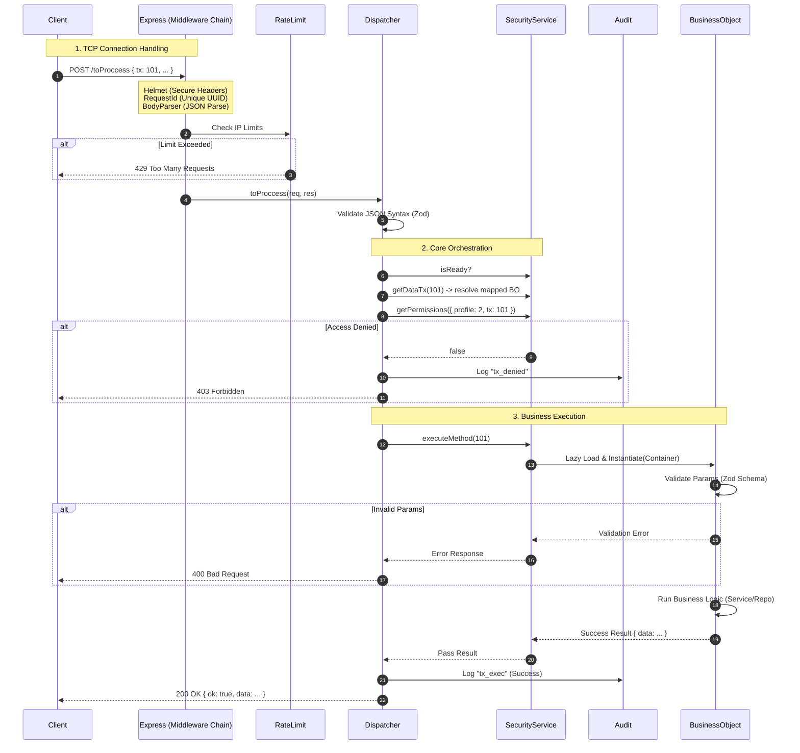

# The Transaction Journey (Detailed Flow)

Let's microscopically analyze what happens when you perform `POST /toProccess`.

## Complete Sequence Diagram

## Step-by-Step Analysis

### 1. The Middleware Chain (The Filter)

Before our "smart" code touches the request, Express passes through several filters:

- **Helmet**: Adds anti-hacker headers (X-XSS-Protection, etc).
- **Request ID**: Assigns a unique ID (e.g., `req-12345`) to track the request in logs.
- **Request Logger**: Writes "INCOMING POST /toProccess" to console.
- **Rate Limit**: If that IP performed 100 requests in 1 minute, it blocks here.

### 2. The Dispatcher (The Coordinator)

Only when the request survives filters does it reach `Dispatcher.toProccess`.

- **Structural Validation**: Checks JSON has `{ tx: number, params: object }`. If garbage is sent, it rejects before bothering the database.
- **Active Wait**: If system is booting (`security.isReady == false`), it waits a few milliseconds before failing.

### 3. Security & Audit

- **Resolution**: Converts `tx: 101` into `AuthBO.login`.
- **Permissions**: Consults in-memory matrix (loaded at start). Extremely fast (nanoseconds).
- **Audit**: If you fail, it's recorded in `audit_log` with IP, user, and rejection reason.

### 4. Business Execution

The BO is instantiated on demand (Lazy Load).

- Receives `Container` with open DB connection.
- Validates data semantically (e.g., "Is email format valid?").
- Executes task.

### 5. Response

The `Dispatcher` captures the result, wraps it in `{ ok: true, data: ... }`, and sends it.
Finally, logs "OUTGOING 200 OK" and duration (e.g., `45ms`).
