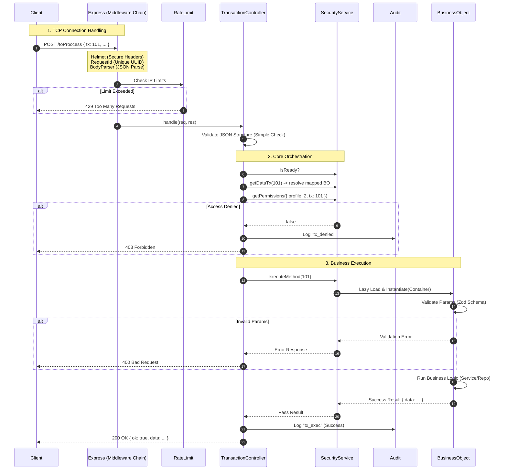

# The Journey of a Request (Transaction Flow)

Let's do a microscopic analysis of what happens when you `POST /toProccess`.

## Full Sequence Diagram

## Step-by-Step Analysis

### 1. The Middleware Chain (The Filter)

Before our "smart" code touches the request, Express goes through several filters:

- **Helmet**: Adds anti-hacker headers (X-XSS-Protection, etc).
- **Request ID**: Assigns a unique ID (e.g. `req-12345`) to the request for log tracing.
- **Request Logger**: Writes "INCOMING POST /toProccess" to the console.
- **Rate Limit**: If that IP has made 100 requests in 1 minute, it's blocked here.

### 2. The TransactionController (The Orchestrator)

Only when the request has survived the filters, it reaches the `TransactionController.handle` method.

- **Structural Validation**: Checks that the JSON has `{ tx: number, params: object }`. Garbage is rejected before bothering the database.
- **Active Wait**: If the system is booting (`security.isReady == false`), it waits a few milliseconds before failing.

### 3. Security and Audit

- **Resolution**: Converts `tx: 101` to `AuthBO.login`.
- **Permissions**: Consults the in-memory matrix (loaded at startup). It is extremely fast (nanoseconds).
- **Audit**: If you fail, it's recorded in `audit_log` with your IP, user, and rejection reason.

### 4. Business Execution

The BO is instantiated on demand (Lazy Load) via `SecurityService`.

- Receives the `Container` with the DB connection already open.
- Semantically validates data (e.g. "Is the email format valid?").
- Executes the task.

### 5. Response

The `TransactionController` captures the result, wraps it, and sends it.
Finally, "OUTGOING 200 OK" and the duration (e.g. `45ms`) are logged.
