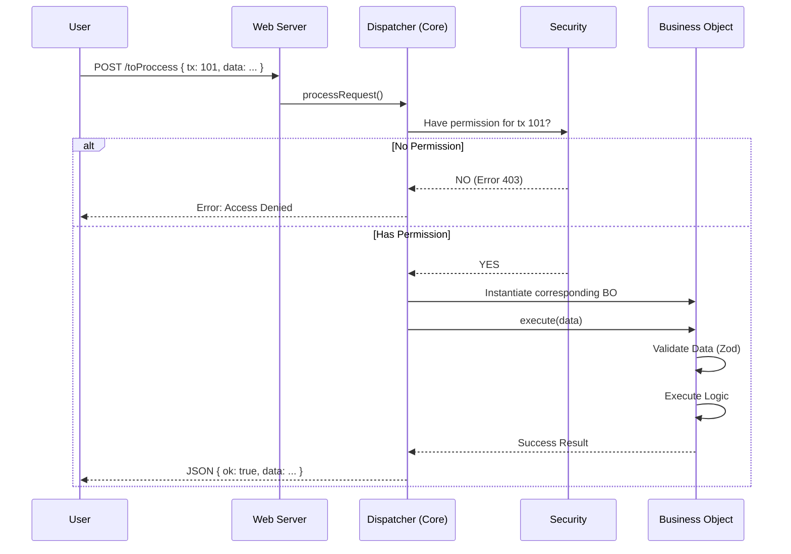

# Transaction Flow

Every time someone clicks in your app, a fascinating journey begins. Here is the lifecycle of a request.

## Sequence Diagram

## Step by Step

1.  **Entry**:
    Everything enters through a single endpoint: `/toProccess`. This simplifies error handling and security.

2.  **Identification (`tx`)**:
    The client sends a transaction code (`tx`). Example: `100` for Login, `200` for Create User.

3.  **Security**:
    Before executing anything, the system checks:
    - Who is the user? (Session/Token)
    - Does this user have permission to execute `tx: 100`?

4.  **Dispatch**:
    If authorized, the `Dispatcher` looks up which code (BO) to run in its transaction map.

5.  **Execution**:
    The Business Object "wakes up", validates data, and does its magic.

6.  **Response**:
    The system always returns a standard JSON format.
