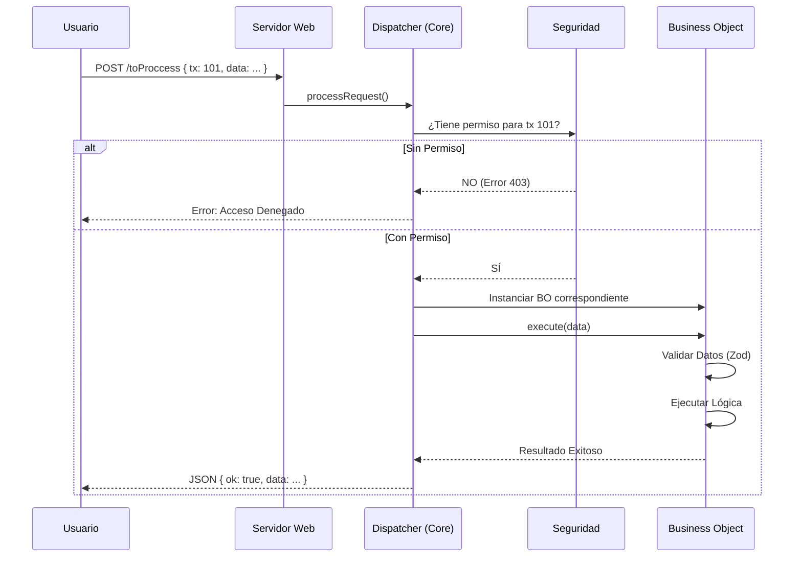

# Flujo de Transacción (Transaction Flow)

Cada vez que alguién hace click en tu aplicación, ocurre un viaje fascinante. Aquí te explicamos el ciclo de vida de una petición.

## Diagrama de Secuencia

## Paso a Paso

1.  **Entrada**:
    Todo entra por un solo endpoint: `/toProccess`. Esto simplifica el manejo de errores y seguridad.

2.  **Identificación (`tx`)**:
    El cliente envía un código de transacción (`tx`). Ejemplo: `100` para Login, `200` para Crear Usuario.

3.  **Seguridad**:
    Antes de ejecutar nada, el sistema verifica:
    - ¿Quién es el usuario? (Sesión/Token)
    - ¿Ese usuario tiene permiso para ejecutar la `tx: 100`?

4.  **Despacho (Dispatch)**:
    Si hay permiso, el `Dispatcher` busca en su mapa de transacciones qué código (BO) debe ejecutarse.

5.  **Ejecución**:
    Se "despierta" al Business Object, este valida los datos y hace su magia.

6.  **Respuesta**:
    El sistema devuelve siempre un formato estándar JSON.
