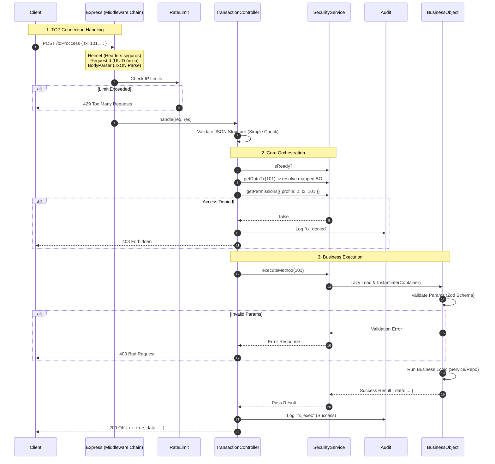

# El Viaje de una Petición (Transaction Flow)

Vamos a analizar microscópicamente qué pasa cuando haces `POST /toProccess`.

## Diagrama de Secuencia Completo

## Análisis Paso a Paso

### 1. La Cadena de Middlewares (El Filtro)

Antes de que nuestro código "inteligente" toque la petición, Express (configurado por `AppServer`) pasa por varios filtros:

- **Helmet**: Añade headers anti-hacker (X-XSS-Protection, etc).
- **Request ID**: Asigna un ID único (e.g. `req-12345`) a la petición para poder rastrearla en los logs.
- **Request Logger**: Escribe "INCOMING POST /toProccess" en la consola.
- **Rate Limit**: Si esa IP ha hecho 100 peticiones en 1 minuto, la bloquea aquí.

### 2. El TransactionController (El Orquestador)

Solo cuando la petición ha sobrevivido a los filtros, llega al método `handle` del `TransactionController`.

- **Validación Estructural**: Revisa que el JSON tenga `{ tx: number, params: object }`. Si envías basura, te rechaza antes de molestar a la base de datos.
- **Espera Activa**: Si el sistema está arrancando (`security.isReady == false`), espera unos milisegundos antes de fallar.

### 3. Seguridad y Auditoría

- **Resolución**: Convierte `tx: 101` en `AuthBO.login`.
- **Permisos**: Consulta la matriz en memoria (cargada al inicio). Es extremadamente rápido (nanosegundos).
- **Audit**: Si fallas, queda registrado en `audit_log` con tu IP, usuario, y razón del rechazo.

### 4. Ejecución del Negocio

El BO se instancia al momento (Lazy Load) a través del `SecurityService`.

- Recibe el `Container` con la conexión DB ya abierta.
- Valida semánticamente los datos (e.g., "El email tiene formato válido?").
- Ejecuta la tarea.

### 5. Respuesta

El `TransactionController` captura el resultado, lo envuelve y lo envía.
Finalmente, registra "OUTGOING 200 OK" y el tiempo que tomó (e.g. `45ms`).
