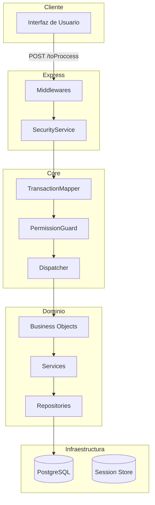

# Arquitectura de ToProccess

## Visión General

ToProccess es un framework backend en Node.js + TypeScript que implementa una arquitectura orientada a transacciones con separación clara de responsabilidades.



## Principios de Diseño

### 1. Inversión de Dependencias (DI)

Todas las dependencias se inyectan mediante constructores, habilitando testabilidad y bajo acoplamiento.

```typescript
// Las dependencias se inyectan, nunca se importan directamente
export default class ProductBO extends BaseBO {
    constructor(deps: BODependencies) {
        super(deps)
    }
}
```

### 2. Transacciones como Unidad de Trabajo

Cada operación de negocio es una "transacción" identificada por un código único.

```typescript
// transactionMap.ts
export const transactionMap: TransactionMap = {
    PRD_GET: { bo: 'Product', method: 'get', profiles: [1, 2, 3] },
    PRD_CREATE: { bo: 'Product', method: 'create', profiles: [1] },
}
```

### 3. Validación con Zod

Los esquemas Zod definen contratos de entrada/salida type-safe.

```typescript
// schemas.ts
export const CreateProductSchema = z.object({
    name: z.string().min(2).max(100),
    price: z.number().positive(),
})
```

---

## Componentes Principales

### SecurityService

Orquestador principal del flujo de transacciones. Responsable de:

- Autenticación de sesión
- Routing a transacciones
- Coordinación con PermissionGuard

**Ubicación:** `src/SecurityService.ts`

### TransactionMapper

Mapea códigos de transacción a Business Objects y métodos.

**Ubicación:** `src/core/routing/TransactionMapper.ts`

### PermissionGuard

Verifica permisos del usuario basado en perfiles.

**Ubicación:** `src/core/auth/PermissionGuard.ts`

### Dispatcher

Instancia y ejecuta Business Objects dinámicamente.

**Ubicación:** `src/core/dispatcher/Dispatcher.ts`

### BaseBO

Clase base para todos los Business Objects con helpers para respuestas y validación.

**Ubicación:** `src/core/base/BaseBO.ts`

### AppValidator

Servicio de validación moderno con Zod y mensajes i18n.

**Ubicación:** `src/core/validation/AppValidator.ts`

---

## Estructura de Directorios

```
src/
├── core/                    # Núcleo del framework
│   ├── base/               # Clases base (BaseBO)
│   ├── validation/         # AppValidator, tipos
│   ├── routing/            # TransactionMapper
│   ├── dispatcher/         # Dispatcher
│   ├── auth/               # PermissionGuard
│   ├── i18n/               # I18nService
│   └── response/           # ApiResponse
├── BO/                      # Business Objects de dominio
│   ├── Auth/               # Autenticación (Login, Logout)
│   └── [Feature]/          # Cada feature tiene su carpeta
│       ├── schemas.ts      # Esquemas Zod
│       ├── repository.ts   # Acceso a datos
│       ├── service.ts      # Lógica de negocio
│       └── index.ts        # BO principal
├── express/                 # Middlewares y handlers Express
├── helpers/                 # Utilidades (sanitize, validators)
├── session/                 # SessionManager
└── types/                   # Tipos globales (core.d.ts)
```

---

## Flujo de una Transacción

1. **Request** llega a `POST /toProccess` con `{ tx: 'PRD_GET', params: {...} }`
2. **Middlewares** procesan (CORS, session, CSRF, body parser)
3. **SecurityService** recibe la solicitud
4. **TransactionMapper** resuelve `tx` → `{ bo: 'Product', method: 'get' }`
5. **PermissionGuard** verifica que el perfil del usuario tenga acceso
6. **Dispatcher** instancia `ProductBO` con dependencias
7. **ProductBO.get()** ejecuta lógica de negocio
8. **Response** retorna `{ code: 200, msg: 'OK', data: {...} }`

---

## Inyección de Dependencias

Todas las clases reciben sus dependencias vía constructor:

```typescript
interface BODependencies {
    db: IDatabase // Capa de base de datos
    log: ILogger // Servicio de logging
    config: IConfig // Configuración
    v: IValidator // Validador (AppValidator)
    i18n?: II18nService // Servicio de internacionalización
}
```

Esto permite:

- **Testabilidad**: Mocks fáciles para unit tests
- **Flexibilidad**: Cambiar implementaciones sin modificar consumidores
- **Claridad**: Dependencias explícitas en la firma

---

## Patrones de Respuesta

Todos los BOs retornan `ApiResponse`:

```typescript
interface ApiResponse<T = unknown> {
    code: number // HTTP status code
    msg: string // Mensaje descriptivo
    data?: T // Datos de respuesta (opcional)
    alerts?: string[] // Mensajes de validación/error (opcional)
}
```

Helpers en BaseBO:

- `this.success(data)` → `{ code: 200, msg: 'OK', data }`
- `this.created(data)` → `{ code: 201, msg: 'Created', data }`
- `this.error(msg, code)` → `{ code, msg }`
- `this.validationError(alerts)` → `{ code: 400, alerts }`
